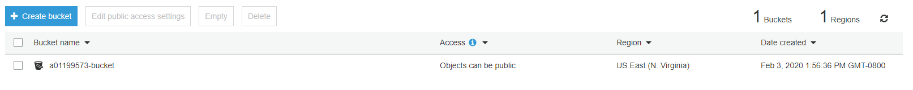
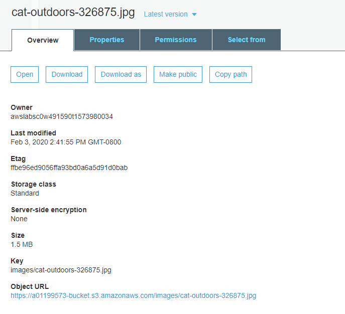
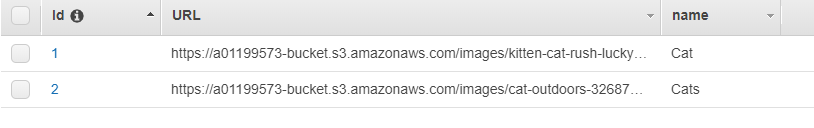
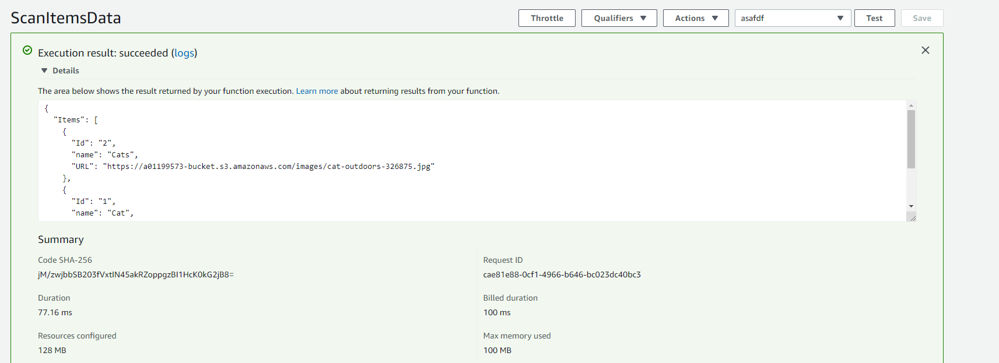
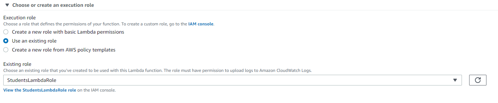

# AWS Final Assignment

## S3 Bucket

This is the S3 Bucket

This is the image in the S3 Bucket

## Dynamo DB

This is my Dynamo DB it contains the URL to the S3 Bucket

## Lambda Functions

The following lambda function scans the database and returns it as a JSON.

And wah-la, it works!

With the Lambda functions it is important to remember to assign the correct roles or else they don't work

## 
